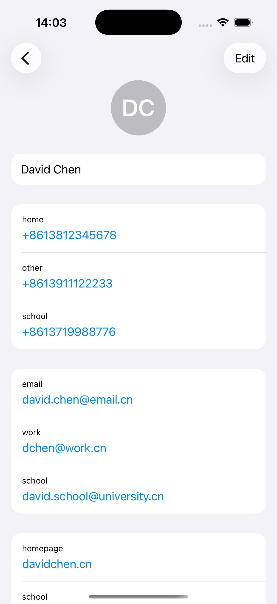
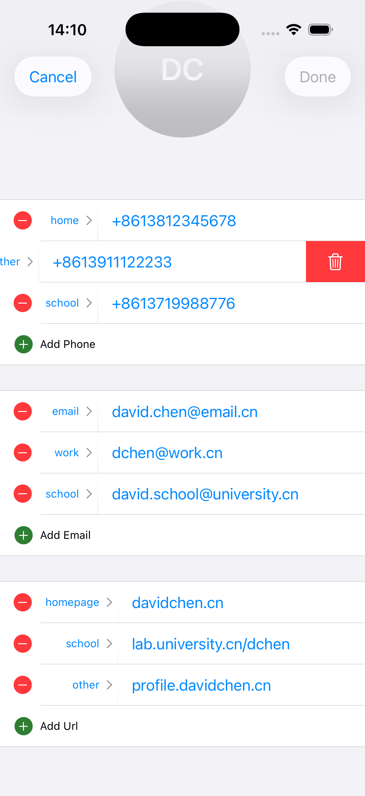
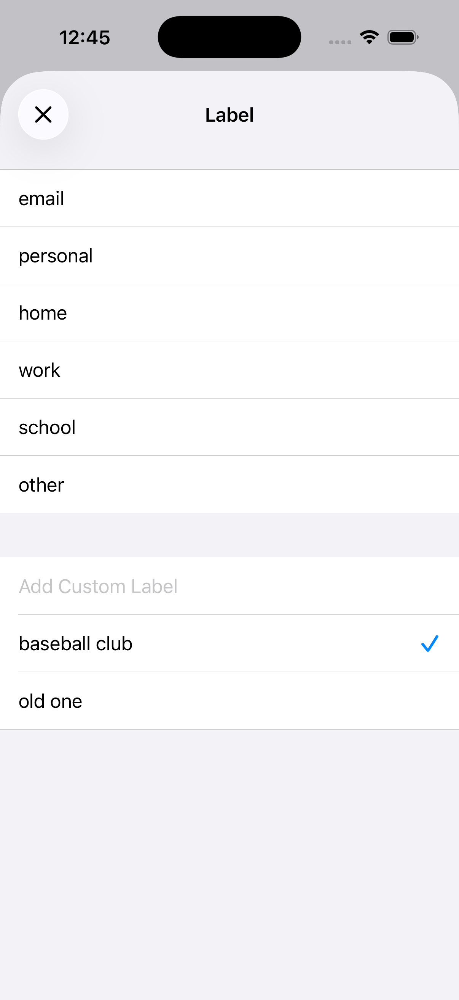

# ContactFieldKit 📇

A SwiftUI package that provides native iOS-style contact field management for phones, emails, and URLs. Built to match the look and feel of Apple's Contacts app.

| Contact details | Edit contact | Pick a label |
|-----------------|--------------|--------------|
|  |  |  |


## Features

- ✅ Display and edit phone numbers, emails, and URLs
- ✅ Native iOS-style interface matching Apple's Contacts app
- ✅ Built-in labels (Home, Work, Mobile, etc.) with custom label support
- ✅ Swipe-to-delete functionality
- ✅ Add/remove contact items dynamically
- ✅ Label picker with common presets
- ✅ `Codable` models for easy persistence
- ✅ Long-press to copy contact values
- ✅ Automatic validation and formatting

## Installation

### Swift Package Manager

Add ContactFieldKit to your project via Xcode:

1. File → Add Package Dependencies
2. Enter package URL: `https://github.com/BaptisteSansierra/ContactFieldKit`
3. Select version and add to your target

Or add it to your `Package.swift`:
```swift
dependencies: [
    .package(url: "https://github.com/BaptisteSansierra/ContactFieldKit", from: "1.0.0"),
    .package(url: "https://github.com/BaptisteSansierra/NoFlyZone", from: "1.0.0")
]
```

## Usage

### Basic Setup
```swift
import SwiftUI
import ContactFieldKit

struct ContactView: View {
    @State private var phones: [ContactItem] = [
        ContactItem(phone: "+12125550112", label: .home),
        ContactItem(phone: "+13105557834", label: .mobile),
        ContactItem(phone: "+14155559021", label: .work),
        ContactItem(phone: "+16175551276", label: .custom("assistant"))
    ]
    
    @State private var emails: [ContactItem] = [
        ContactItem(email: "alice.johnson@email.com", label: .email),
        ContactItem(email: "alice.home@example.com", label: .home),
        ContactItem(email: "alice.work@company.com", label: .work)
    ]
    
    @State private var urls: [ContactItem] = [
        ContactItem(url: "alicejohnson.com", label: .homepage),
        ContactItem(url: "intranet.company.com/alice", label: .work)
    ]
    
    var body: some View {
        VStack {
            ContactItemView(contactItems: $phones)
            ContactItemView(contactItems: $emails)
            ContactItemView(contactItems: $urls)
        }
    }
}
```

### Display Mode (Read-Only)

Use `ContactItemView` to display contact information:
```swift
ContactItemView(contactItems: $phones)
```

Features:
- Tap phone numbers to call
- Tap emails to compose
- Tap URLs to open in browser
- Long-press any value to copy

### Edit Mode

Use `ContactItemEditView` for full editing capabilities:
```swift
@State private var noFlyZoneEnabled = false
@State private var noFlyZoneCompletionStatus: NoFlyZoneCompletionStatus = .none
@State private var noFlyAuthorizedZones: [NoFlyZoneData] = []

ContactItemEditView(
    viewIdentifier: 1,
    kind: .phone,
    values: $phones,
    noFlyZoneEnabled: $noFlyZoneEnabled,
    noFlyZoneCompletionStatus: $noFlyZoneCompletionStatus,
    noFlyAuthorizedZones: $noFlyAuthorizedZones
)
```

Features:
- Add new contact items
- Swipe to delete items
- Edit values inline
- Change labels via picker
- Automatic keyboard types per field type

### ContactItem Model

The `ContactItem` model is `Codable` for easy persistence:
```swift
// Create items
let phone = ContactItem(phone: "+1234567890", label: .mobile)
let email = ContactItem(email: "user@example.com", label: .work)
let url = ContactItem(url: "example.com", label: .homepage)

// Encode to JSON
let encoder = JSONEncoder()
let data = try encoder.encode(phones)

// Decode from JSON
let decoder = JSONDecoder()
let decodedPhones = try decoder.decode([ContactItem].self, from: data)

// Store as string in database
let jsonString = String(data: data, encoding: .utf8)
```

### Available Labels

ContactFieldKit provides standard labels that match Apple's Contacts app:

**Phone Labels:**
- `.phone`
- `.mobile`
- `.home`
- `.work`
- `.school`
- `.other`
- `.custom(String)` - for custom labels

**Email Labels:**
- `.email`
- `.personal`
- `.work`
- `.home`
- `.school`
- `.other`
- `.custom(String)`

**URL Labels:**
- `.url`
- `.homepage`
- `.home`
- `.work`
- `.school`
- `.other`
- `.custom(String)`

## Dependencies

ContactFieldKit uses [NoFlyZone](https://github.com/BaptisteSansierra/NoFlyZone) for swipe-to-delete functionality with interaction blocking.

## Requirements

- iOS 17.0+
- macOS 14.0+
- Swift 5.9+

## Example Project

Check out the [Example](Example/) folder for a complete demo app showing:
- Contact detail views
- Contact editing with multiple field types
- Label customization

## License

ContactFieldKit is available under the MIT license. See the LICENSE file for more info.

## Author

Baptiste Sansierra - [@BaptisteSansierra](https://github.com/BaptisteSansierra)

---

⭐️ If you find ContactFieldKit useful, please give it a star on GitHub!
